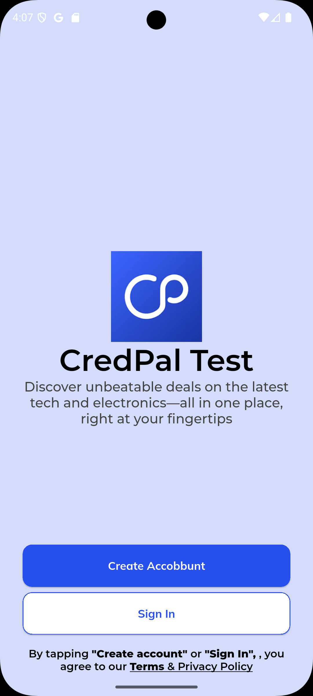
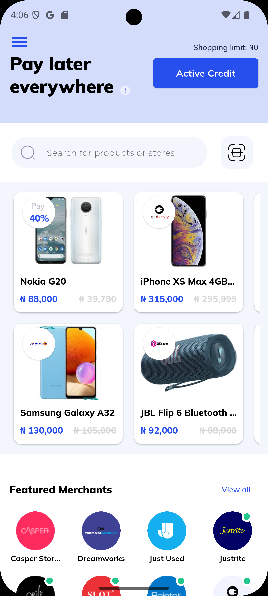
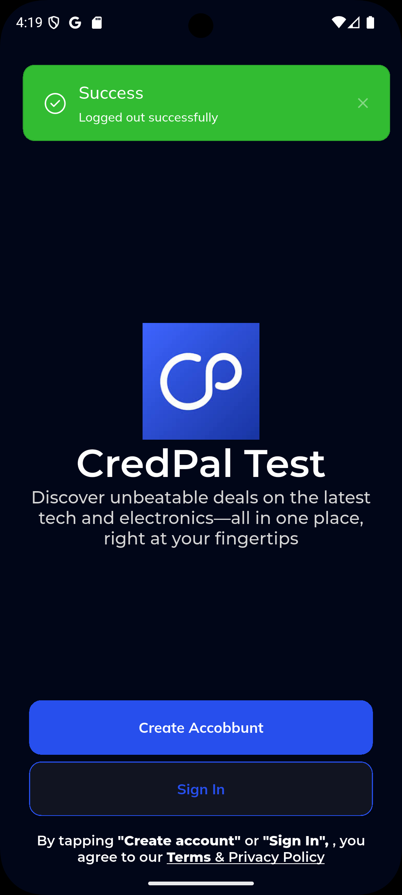
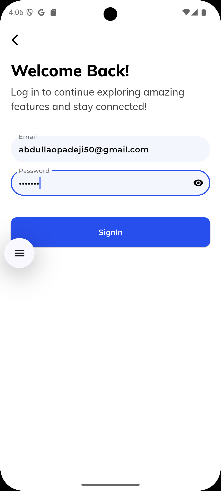
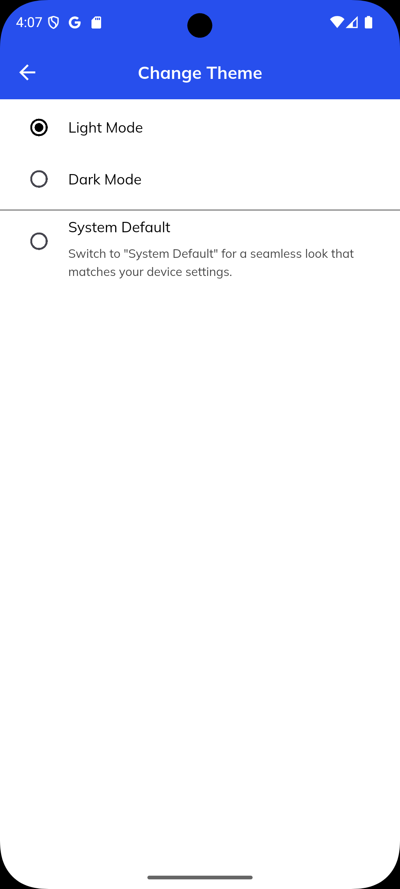
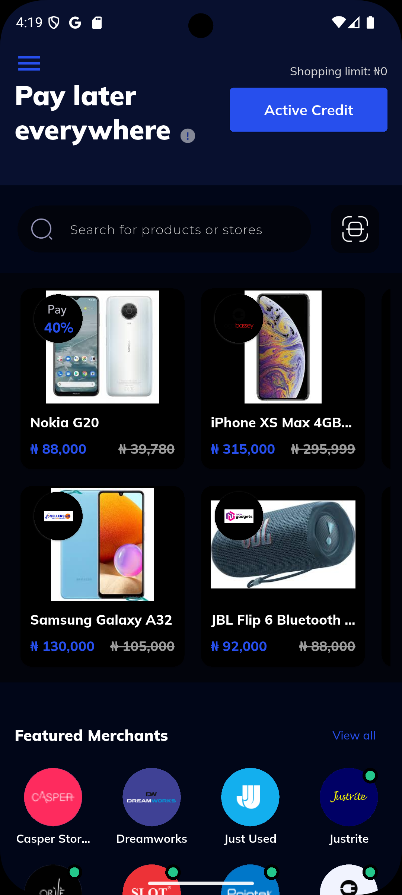
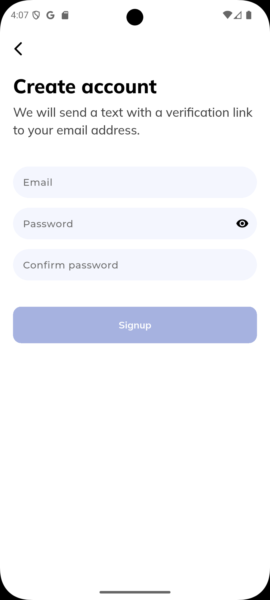
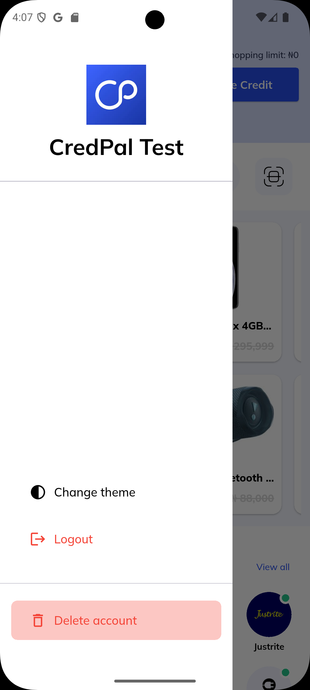
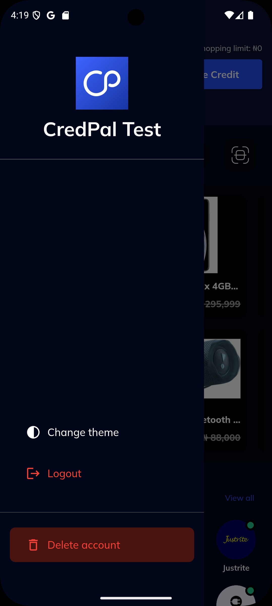
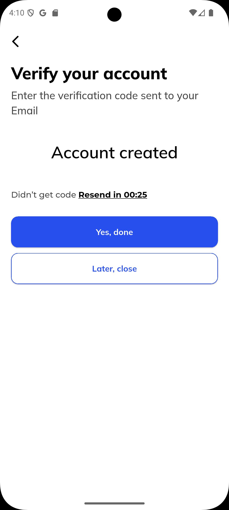

# Credpal Test 🧼📲

A clean, smooth, and modern mobile application built with **Flutter** for Flutter dev assessment. This app showcases a production-grade folder structure, user authentication with **Supabase**, beautiful screen transitions and theming, and proper state management using **Riverpod**. Every piece of this project was crafted with best practices in mind. 💪

---

## 📱 App Screenshots

Here are the screens representing the major user flows and components of the app:
<div align="center">

| Onboarding & Auth | Home & Drawer | Dark Mode & Feedback |
|------------------|------------------|-----------------------|
|  <br/> *Onboarding* |  <br/> *Home Screen* |  <br/> *Dark Mode Onboarding* |
|  <br/> *Login Screen* |  <br/> *Change Theme* |  <br/> *Dark Mode - Home* |
|  <br/> *Signup* |  <br/> *Drawer* |  <br/> *Dark Mode Drawer* |
|  <br/> *Verify Account* |  |  |

</div>


---

## 🚀 APK Download

👉 [Download the latest APK](https://drive.google.com/file/d/1TU2gA41o3K238UhoWpZV7MjR8Tp-Aa_R/view?usp=drive_link) to experience the app live!

---

## 🧠 Project Highlights

- ✅ **Clean Architecture** using `feature/` separation and layered folders (`data`, `presentation`, etc.)
- 🔐 **Supabase Authentication** — sign in, sign up, email verification flow handled smoothly with Supabase
- 🎨 **Custom Theming** — consistent light & dark modes using `theme/` services
- 🪄 **Smooth Animations** — subtle, implicit animations used to enhance user experience
- 🧱 **Riverpod** — robust state management with clean separation of concerns
- 🔁 **Page Navigation** — centralized and error-proof routing handled in `core/router`
- 🧪 Modular and testable components with `core/services`, `core/widgets`, and `utils/`
- 🔥 Not part of the assessment: integrated **email verification** system through Supabase!

---

## 📁 Folder Structure

```
lib/
├── core/
│   ├── router/               # Handles app navigation and routing
│   ├── services/             # Root API cals setup & configuration.
│   ├── theme/                # App light and dark themes
│   ├── util/                 # Shared utilities
│   ├── widgets/              # Reusable widgets
│   └── page_not_found.dart
│
├── feature/
│   ├── auth/
│   │   ├── data/             # Auth models and services
│   │   └── presentation/
│   │       ├── create_account/
│   │       ├── logout_delete_controller/
│   │       ├── signin/
│   │       │   ├── signin_controller.dart
│   │       │   └── signin.dart
│   │       ├── verify_account/
│   │       └── welcome_auth/
│   │
│   ├── home/
│   │   ├── data/
│   │   └── presentation/
│   │       ├── home_page/
│   │       │   ├── home_page.dart
│   │       │   ├── home_page_controller.dart
│   │       │   ├── page_drawer.dart
│   │       │   └── some_page.dart
│
├── gen/
│
├── app.dart
└── main.dart
```

---

## ⚙️ How to Run the App

Make sure you have Flutter and Dart set up properly on your machine.

```bash
flutter pub get
dart run build_runner build
flutter run -d chrome
```

💡 *Use `flutter config --enable-web` if web support isn't enabled.*

---

## 🔧 Integrations Used

| Feature             | Technology     |
|---------------------|----------------|
| Authentication      | Supabase       |
| State Management    | Riverpod       |
| Routing             | Named Route       |
| Theming             | Inbuilt Flutter supported Theme  |
| Animations          | Flutter’s Animated Widgets |
| Code Generation     | build_runner   |
| Firebase alternative | Supabase (auth + db) |

---

## 💡 Extra Effort

> This project goes *beyond the requirements* by integrating:

- ✅ Full Supabase Auth Flow (Sign-up, Sign-in, Email Verification)
- ✅ Theming with smooth toggles
- ✅ State management using Riverpod for scalable logic
- ✅ Animated widgets for better UI experience
- ✅ Clean code structure for long-term maintainability
- ✅ Ready for testing and modular scalability

---

## 🙋‍♂️ About the Developer

Crafted with ❤️ by **Abdullah**, a passionate Flutter developer who cares deeply about clean UI/UX, readable code, and robust architecture.

📬 [Connect on LinkedIn](https://www.linkedin.com/in/abdullah-opadeji-06385b20b/)  
🌐 [Check my Website](https://abdorll.github.io)

---

## 📌 Final Words

> Hope you enjoy exploring the app as much as I enjoyed building it!  
> **Crafting beautiful experiences with Flutter 💙🚀**
